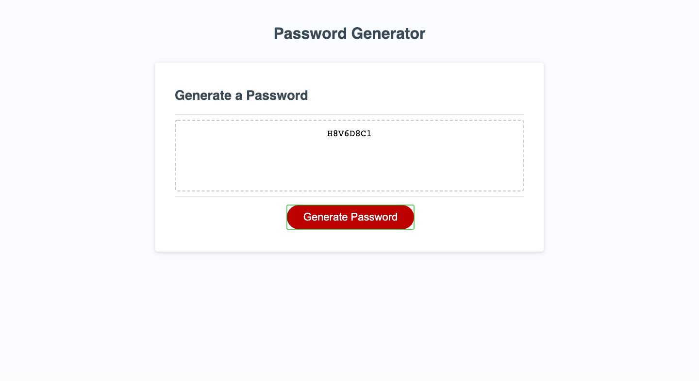

# Password Generator

## Description
A password generator which produces secure passwords.

## Screenshot

## Link to Live URL
https://1jorcarver.github.io/password-generator/

## Website Languages
HTML, CSS, and JavaScript

## Intended Website Functionality
- The user is able to create a secure password from 8 to 128 characters long. 
- The password contains lower and upper case letters, special characters, and numbers.
- Once the user has followed the prompts and met all of the criteria, the website populates the password, writing it on the screen.

## Contribution
- I received assistance from the TA and used a lot of MDN and other tutorials/websites. 

